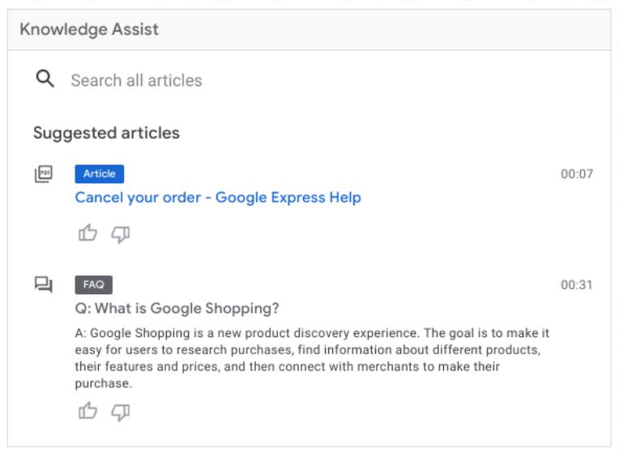
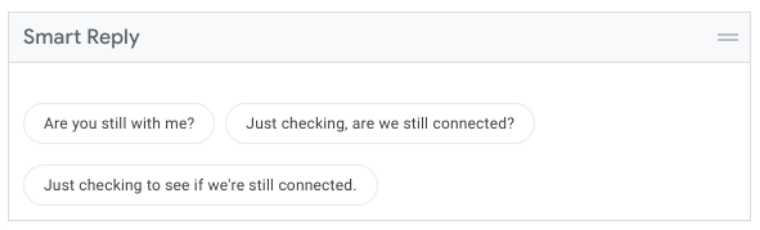
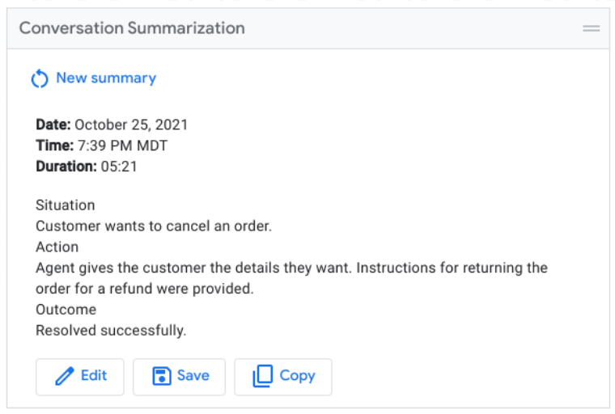

# Agent Assist Modules Documentation

## Introduction

The Agent Assist modules are a set of pre-built, customizable UI components that can be embedded in any web application to surface [Google Agent Assist](https://cloud.google.com/agent-assist) suggestions. These are made available as a set of JavaScript Web Components and services hosted on Google's GStatic domain.
In addition to the components themselves, a set of reference implementations will also be provided that will provide examples of how the modules can be integrated into certain agent desktop platforms. 

<br>

## Related documentation and support

 - For help with uploading conversation data, training Agent Assist models, or configuring your conversation profile, please refer to the [Agent Assist documentation](https://cloud.google.com/agent-assist/docs).

 - For help with integrating the Agent Assist Modules into your application, please reach out to agent-assist-ui-modules-support@google.com.

<br>

## High-level approach

There are two primary approaches for integrating the Agent Assist modules into your application - the managed container approach, or as individually imported components. 

<br>

## Managed container

In the managed container approach, we will provide a single component that renders the desired Agent Assist features in a unified panel. This panel will also handle all shared module concerns, including the loading of connectors and any error messaging. This is the approach we recommend if integrating the modules into a third-party agent desktop such as LivePerson or Genesys Cloud, or where minimal to no customization is required. 

After the container component is initialized, it will load all necessary dependencies. Only a single script should need to be imported in this case, no matter how many Agent Assist features are used. 

```
<script src="https://www.gstatic.com/agent-assist-ui-modules/container.js"></script>
```

Element tag name:
```
<agent-assist-ui-modules-container>
```

Example:

```
<agent-assist-ui-modules-container
    features="SMART_REPLY,ARTICLE_SUGGESTION"
    conversation-profile="projects/my-project/conversationProfiles/abc123"
    agent-desktop="LivePerson"
    auth-token="abc123"
    channel="chat"
    custom-api-endpoint="https://my-dialogflow-proxy-service.com"
    dark-mode-background="#000000"
></agent-assist-ui-modules-container>
```

<b>Attributes</b>

| Atribute name | Expected values | Description |
| ----------- | ----------- | ----------- |
| features | Comma-separated string specifying one or more of the below Agent Assist features: <br>“SMART_REPLY”, “ARTICLE_SUGGESTION”, “FAQ”, “ARTICLE_SEARCH”, “CONVERSATION_SUMMARIZATION”, “DIALOGFLOW_ASSIST” | Comma-separated string specifying one or more Agent Assist features. |
| api-headers  | String in the format of "header1:value,header2:value,..." | Comma-separated list of api headers to include in the call to the Dialogflow proxy server, if one is used. |
| conversation-profile | String in the format of "projects/<project_id>/conversationProfiles/<conversation_profile_id>" | Conversation profile resource name. |
| use-custom-conversation-id | "true" \| "false" | Whether to use the conversation ID assigned by the agent desktop (defaults to true). If not, it will generate a new one for each conversation. |
| agent-desktop | “LivePerson” \| “GenesysCloud” | The agent desktop plaform the modules will be integrated in. |
| auth-token | string | The Bearer token used to authenticate the agent when calling the Dialogflow API or proxy server. If calling the Dialogflow API directly, this should be a valid Google OAuth token. |
| api-key | string | API key used to call the Dialogflow proxy server. |
| channel | “chat” \| ”voice” \| ”omnichannel” | The communication channel that will be used (chat conversation, voice conversation, or both). |
| custom-api-endpoint | string | The URL of the Dialogflow proxy server, if one is used. |
| show-header | "true" \| "false" | Whether to show an “Agent Assist suggestions” header. Defaults to "false". |
| dark-mode-background | string | The hexidecimal color value for the background color to use for dark mode. |

<br>

## Individual components

<i>NOTE - If no custom implementation is needed, then the below information can be ignored. </i>

The second approach for integrating the Agent Assist modules is to import each component and connector independently. We only recommend this approach if a custom application is used where the modules may need to be rendered in different sections of the page, or if significant customization is required.

In this case, the module for each Agent Assist feature used will need to be independently imported. In addition, the base connector service will also need to be imported, as well as any custom connectors that can integrate with non-supported agent desktops.

<br>

### Base connector service

The base connector service is used to automatically load and manage all necessary connectors for the Agent Assist UI modules. This should only be imported if the components are imported independently, as opposed to the managed container approach.

The service can be included by adding the following code to your application:

```
<script src=”https://www.gstatic.com/agent-assist-ui-modules/ui_modules_connector.js”></script>
```

This will expose a global UiModuleConnector class that can then be instantiated and initialized.

<b>Public methods:</b>

```
constructor(): void;

init(config: ConnectorConfig): void;

disconnect(): void;

setAuthToken(token: string): void;
```

Below is the full TypeScript interface for the connector configuration object.

```
interface ConnectorConfig {
  /** Communication mode for the UI modules application. */
  channel: 'chat'|'voice'|'omnichannel';

  /** Agent desktop to use. */
  agentDesktop: 'LivePerson'|'Genesys'|'SalesForce'|'Custom';

  /** Conversation profile name to use. */
  conversationProfileName: string;

  /** API Connector config. */
  apiConfig: {
    /**
     * Authentication token to attach to outgoing requests. Should be a valid
     * OAuth token for Dialogflow API, or any other token for custom API
     * endpoints.
     */
    authToken: string;

    /**
     * Specifies a custom proxy server to call instead of calling the Dialogflow
     * API directly.
     */
    customApiEndpoint?: string;

    /** API key to use. */
    apiKey?: string;

    /**
     * Additional HTTP headers to include in the Dialogflow/proxy server API
     * request.
     */
    headers?: Array<readonly[string, string]>;
  }

  /** Event-based connector config. Set this for voice conversations. */
  eventBasedConfig?: {
    /**
     * Transport protocol to use for updates. Defaults to 'websocket' if none is
     * specified.
     */
    transport?: 'websocket'|'polling';

    /** Event-based library to use (i.e., Socket.io). */
    library?: 'SocketIo';

    /** Endpoint to which the connection will be established. */
    notifierServerEndpoint: string;
  }

  /**
   * Whether to use a custom conversation ID when creating a new Dialogflow
   * conversation. Defaults to false.
   */
  useCustomConversationId?: boolean;
}

```

Example instantiation:

```
const connector = new UiModuleConnector();

connector.init({
  channel: 'voice',
  agentDesktop: 'LivePerson',
  conversationProfileName: 'projects/my-project/conversationProfiles/123',
  apiConfig: {
    authToken: 'abc123',
    customApiEndpoint: 'https://my-dialogflow-proxy-server.com',
  }
});
```

<br>

### Individual modules

#### <b>Knowledge Assist</b>



The Knowledge Assist module can be imported using the following code:

```
<script src="https://www.gstatic.com/agent-assist-ui-modules/knowledge_assist.js"></script>
```

Then, you can embed the component in the page using the following tag:

```
<agent-assist-knowledge-assist></agent-assist-knowledge-assist>
```

#### <b>Smart Reply</b>



The Smart Reply module can be imported using the following code:

```
<script src="https://www.gstatic.com/agent-assist-ui-modules/smart_reply.js"></script>
```

Then, you can embed the component in the page using the following tag:

```
<agent-assist-smart-reply></agent-assist-smart-reply>
```

#### <b>Conversation Summarization</b>



The Conversation Summarization module can be imported using the following code:

```
<script src="https://www.gstatic.com/agent-assist-ui-modules/summarization.js"></script>
```

Then, you can embed the component in the page using the following tag:

```
<agent-assist-conversation-summarization></agent-assist-conversation-summarization>
```

#### <b>Virtual Agent Assist</b>

Not yet available - coming soon.

<br>

### Custom connector

If integrating the Agent Assist modules into a non-supported agent desktop, a custom connector may need to be written that can facilitate interactions between the agent desktop and the UI modules. This connector will need to be responsible for a handful of operations, including:

1. Dispatching an event to initialize the Dialogflow conversation once the conversation ID is available.
     - Event name: `aa-conversation-initialization-requested`
2. Notifying the module system when the conversation details are available.
     - Event name: `aa-conversation-details-received`
3. For voice conversations, dispatching an event whenever a new utterance is registered from the agent or customer.
     - Event name: `aa-analyze-content-requested`
4. Notifying the module system when 'dark mode' has been toggled in the primary application.
     - Event name: `aa-dark-mode-toggled`

In addition, the connector should subscribe to the following events to update the agent desktop UI where applicable:

1. For Smart Reply, update the agent's input field whenever a Smart Reply chip is selected.
     - Event name: `aa-smart-reply-chip-selected`

The events mentioned above, including their corresponding payloads, can be found in the [table below](#agent-assist-module-events).

Example dispatching of an event:

```
if (newMessageFromHumanAgent) {
  window.dispatchEvent(new CustomEvent('aa-analyze-content-requested', {
    detail: {
      participantRole: 'HUMAN_AGENT',
      request: {
        textInput: {text: newMessageFromHumanAgent},
        messageSendTime: new Date().toISOString()
      }
    }
  }));
}
```

Example subscribing to an event:

```
window.addEventListener('aa-smart-reply-chip-selected', (event) => {
  const chipContent = event.details;
  // Populate the agent chat box with the selected Smart Reply chip.
});
```

<br>

## Implementation Details

### Communication

All communication between the Agent Assist Modules and the connectors happens through the dispatching of custom events on the global Window object. As an example, when an Agent Assist suggestion is received, a connector service will dispatch an 'aa-analyze-content-received' event, which the UI Modules will be subscribed to.

Example:

In the connector service:

```
this.api.analyzeContent(...).then((response) => {
  window.dispatchEvent(new CustomEvent('aa-analyze-content-response-received', {
    detail: {response}}));
});
```

In the module:

```
window.addEventListener('aa-analyze-content-response-received', (response) => {
  // Use the AnalyzeContent response to render suggestions in the UI.
});
```

### Agent Assist Module Events

| Event name | Payload | Description |
| ----------- | ----------- | ----------- |
| <b>General</b> |
| 'aa-analyze-content-requested' | AnalyzeContentRequestDetails | Dispatched when an AnalyzeContent request should be made. |
| 'aa-analyze-content-response-received' | AnalyzeContentResponseDetails | Dispatched when a new AnalyzeContent response has been received. |
| 'aa-conversation-completed' | void | Dispatched when the Dialogflow conversation has completed. |
| 'aa-conversation-details-received' | ConversationDetails | Dispatched when conversation details are received from the SDK (including agent and customer info). |
| 'aa-conversation-initialization-requested' | string | Dispatched when the Dialogflow conversation should be initialized. Payload should be the conversation ID. |
| 'aa-conversation-initialized' | Conversation | Dispatched when the Dialogflow conversation has been initialized. |
| 'aa-dark-mode-toggled' | boolean | Dispatched when dark mode has been set in the agent desktop. |
| 'aa-dialogflow-api-error' | UiModuleError \| null | Dispatched when a Dialogflow API error is encountered. |
| 'aa-dialogflow-api-authentication-error' | void | Dispatched when a Dialogflow API authentication (401) error encountered. |
| 'aa-patch-answer-record-requested' | PatchAnswerRecordPayload | Disaptched when an answer record should be updated. |
| 'aa-patch-answer-record-received' | AnswerRecord | Dispatched when an answer record has been successfully updated. |
| 'aa-snackbar-notification-requested' | SnackbarNotificationPayload | Disaptched when a snackbar notification is requested. |
| <b>Smart Reply</b> |
| 'aa-smart-reply-selected' | string |  Dispatched when a Smart Reply chip is selected. |
| 'aa-smart-reply-follow-up-suggestions-received' |  SmartReplyAnswer[] |  Dispatched when Smart Reply follow-up suggestions have been received. |
| <b>Conversation Summarization</b> |
| 'aa-conversation-summarization-requested' | void | Dispatched when a conversation summarization is requested. |
| 'aa-conversation-summarization-received' | SuggestConversationSummaryResponse | Dispatched when a conversation summarization has been received. |
| <b>Article Search</b> |
| 'aa-article-search-requested' | string | Dispatched when an article search is requested. Payload should be the query text. |
| 'aa-article-search-response-received' | ArticleSearchResponse | Dispatch when an article search response has been received.
| <b>Connector-related</b> |
| 'aa-agent-desktop-connector-initialized' | void | Dispatched when the agent desktop connector has been initialized. |
| 'aa-api-connector-initialized' | void | Dispatched when the API connector has been initialized. |
| 'aa-event-based-connector-initialized' | void | Dispatched when the event-based connector has been initialized. |
| 'aa-agent-desktop-connector-initialization-failed' | void | Dispatched if the agent desktop connector initialization failed. |
| 'aa-api-connector-initialization-failed' | void | Dispatched if the API connector initialization failed. |
| 'aa-event-based-connector-initialization-failed' | void | Dispatched if the event-based connector initialization failed. |

<br>

### Types

#### <b>AnalyzeContentRequestDetails</b>

```
interface AnalyzeContentRequestDetails {
  type?: string;
  conversationId?: string|undefined;
  participantRole: ParticipantRole;
  request: AnalyzeContentRequest;
}
```

#### <b>ParticipantRole</b>

See [API documentation](https://cloud.google.com/dialogflow/es/docs/reference/rest/v2beta1/projects.conversations.participants#Participant.Role).

#### <b>AnalyzeContentRequest</b>

See [API documentation](https://cloud.google.com/dialogflow/es/docs/reference/rest/v2beta1/AnalyzeContentRequest).


#### <b>AnalyzeContentResponseDetails</b>

```
interface AnalyzeContentResponseDetails {
  type?: string;
  response: AnalyzeContentResponse;
}
```

#### <b>AnalyzeContentResponse</b>

See [API documentation](https://cloud.google.com/dialogflow/es/docs/reference/rest/v2beta1/AnalyzeContentResponse).


#### <b>Conversation</b>

See [API documentation](https://cloud.google.com/dialogflow/es/docs/reference/rest/v2beta1/projects.conversations#Conversation).

#### <b>UiModuleError</b>

```
/**
 * Error response that gets disaptched as a global event when an API error
 * occurs. Includes the source of an error, as well as the error details.
 */
interface UiModuleError {
  /** Which action or feature within the application triggered the error. */
  source: SuggestionFeatureType|'ANALYZE_CONTENT'|'INITIALIZATION'|'AUTHORIZATION';
  /** An arbitrary metadata object that can be included with the error .*/
  data?: {[key: string]: any;};
  /** The error response itself. */
  error: GoogleRpcStatus|null;
}
```

#### <b>SuggestionFeatureType</b>

See [API documentation](https://cloud.google.com/dialogflow/es/docs/reference/rest/v2beta1/projects.conversationProfiles#ConversationProfile.Type).

#### <b>GoogleRpcStatus</b>

See [API documentation](https://cloud.google.com/dialogflow/es/docs/reference/rpc/google.rpc#google.rpc.Status).

#### <b>PatchAnswerRecordPayload</b>

```
interface PatchAnswerRecordPayload {
  payload: {
    answerRecord: AnswerRecord;
    previousAnswerRecord?: AnswerRecord|undefined;
  }
  options: {updateMask: string;};
}
```

#### <b>AnswerRecord</b>

See [API documentation](https://cloud.google.com/dialogflow/es/docs/reference/rest/v2beta1/projects.answerRecords#AnswerRecord).

#### <b>SnackbarNotificationPayload</b>

```
/**
 * Payload for snackbar notification actions. Allows users to configure snackbar
 * message, dismiss button text, and dismiss callback.
 */
interface SnackbarNotificationPayload {
  message: string;
  dismissLabel?: string|undefined;
  config?: MatSnackBarConfig|undefined;
  dismissCallback?: () => void;
}
```

#### <b>MatSnackBarConfig</b>

See [Material Design documentation](https://material.angular.io/components/snack-bar/api#MatSnackBarConfig).

#### <b>SmartReplyAnswer</b>

See [API documentation](https://cloud.google.com/dialogflow/es/docs/reference/rest/v2beta1/SuggestSmartRepliesResponse#SmartReplyAnswer).

#### <b>SuggestConversationSummaryResponse</b>

See [private API documentation](https://cloud.google.com/dialogflow/priv/docs/reference/rest/v2beta1/SuggestConversationSummaryResponse).

#### <b>SearchArticlesResponse</b>

See private API documentation.
