# Agent Assist UI Modules - Salesforce integration demo

# Description
In this demo, we will provide an example of how the Agent Assist UI modules can be integrated into a Salesforce Lightning application for voice conversations.
 - We will be creating a new Lightning application within Salesforce, although it can just as easily be added to an existing one.
 - We will use [Salesforce Canvas](https://developer.salesforce.com/docs/atlas.en-us.platform_connect.meta/platform_connect/canvas_framework_intro.htm) to render the modules, which is a tool for integrating third party web applications inside of an iFrame.

> **_NOTE:_** This repository is meant for demonstration purposes only. Do not use any of this code directly in a production environment. Additional configuration will likely be needed to integrate the UI modules into your specific Salesforce client.  Additionally, integrating with a Telephony provider that connects voice conversations to the Agent Assist API is beyond the scope of this demo. For assistance with this, please reach out to the Agent Assist customer engineering team.

# Before you get started

Create or select a Google Cloud project in which you will manage your resources. Make sure it has the `CCAI_BETA` visibility label applied to it. For help with this, please reach out to [agent-assist-ui-modules-support@google.com](mailto:agent-assist-ui-modules-support@google.com)

# Steps

## 1. Set up connector services
* Follow the instructions in [this repository](https://partner-code.googlesource.com/aa-integration-backend/+/refs/heads/main#how-to-deploy-and-run) to clone and deploy the Agent Assist connector services
  * This will allow the Salesforce client that we eventually create to receive real-time suggestions through Pub/Sub. 
* When creating your Conversation Profile, configure it with only the `Conversation Summarization` feature, and choose the Baseline model option.
* Before deploying the connector service, replace the `check_auth` function with the following code.
  * This will validate the user’s Salesforce identity and make sure they belong to the correct organization and have the correct roles to access the service.

```
# Add your Salesforce domain name here.
salesforce_domain_name = ''

# Add your Salesforce organization ID here.
organization_id = ''

# Add the allowed list of Salesforce profiles (i.e., ‘System Administrator’) that should be able to use the UI module service.
allowed_roles = ['']

def check_auth(auth):
    auth_header = {'Authorization': f'Bearer {auth}'}

    # Step 1: Get the user info.
    user_info_url = 'https://login.salesforce.com/services/oauth2/userinfo'
    user_info_resp = requests.get(user_info_url, headers=auth_header)
    if not user_info_resp.ok:
        logging.warning(f'Failed to get user info: {user_info_resp.text}')
        return False

    user_info = user_info_resp.json()

    # Step 2: Check organization id.
    if user_info['organization_id'] != organization_id:
        logging.warning(
            f'Organization id does not match expected id')
        return False

    # Step 3: Get user object metadata.
    user_object_url = f'https://{salesforce_domain_name}.my.salesforce.com/services/data/v55.0/sobjects/User/{user_info["user_id"]}'
    user_object_resp = requests.get(user_object_url, headers=auth_header)
    if not user_object_resp.ok:
        logging.warning(
            f'Failed to get user object metadata: {user_object_resp.text}')
        return False

    user_object = user_object_resp.json()

    # Step 4: Get profile object metadata.
    profile_object_url = f'https://{salesforce_domain_name}.my.salesforce.com/services/data/v55.0/sobjects/Profile/{user_object["ProfileId"]}'
    profile_object_resp = requests.get(profile_object_url, headers=auth_header)
    if not profile_object_resp.ok:
        logging.warning(
            f'Failed to get profile object metadata: {profile_object_resp.text}')
        return False

    # Step 5: Check profile name.
    profile_object = profile_object_resp.json()

    if profile_object['Name'] not in allowed_roles:
        logging.warning(
            f'Profile Name [{profile_object["Name"]}] not in allowlist {allowed_roles}')-
        return False

    return True
```


## 2. Clone Canvas application
Clone [this repository you are currently in](https://partner-code.googlesource.com/agent-assist-ui-modules/+/refs/changes/50/485750/8/salesforce/canvas)
 * It contains a Node.js/Express.js application that renders the Agent Assist UI modules using Salesforce Canvas.
* ***Note - this application is meant to be used purely for demonstration purposes and should <u>not</u> be used directly in production!*** 

## 3. Deploy Canvas application
* Deploy the application to a hosting provider of your choice.
* For the sake of this demo, we recommend using Cloud Run.

## 4. Create a new “Connected App”
In your Salesforce console, Go to `Settings` -> `Set Up`. Go to `App Manager` and click on `New Connected App`.

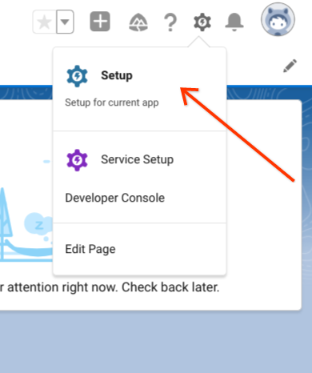

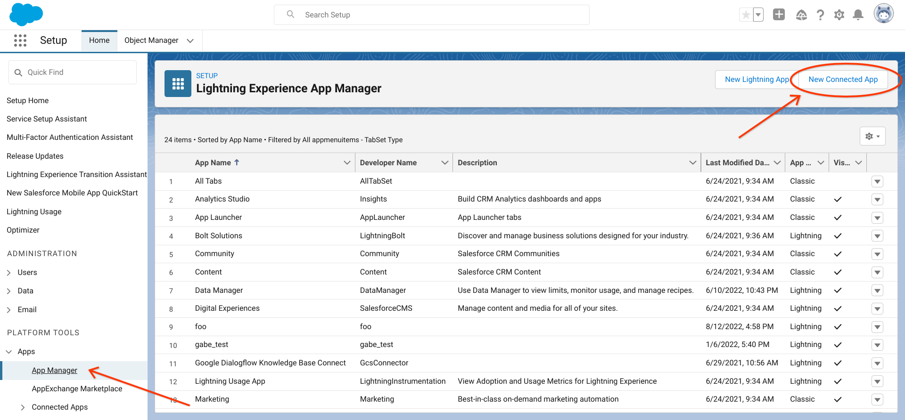

Configure it it with the following parameters:
  * Give it a Connected App Name and Contact Email
  * Select `Enable OAuth Settings`
  * For Callback URL, use the following URL: `deployed_canvas_app_url`/callback
  * For selected OAuth scopes, select `Access the Identity URL service` and `Perform requests at any time`
  * Select only the `Require Secret For Web Server Flow`
  * Under Canvas App Settings, select `Canvas`
  * For the Canvas App URL, use the following format:
`deployed_canvas_app_url`/main?conversationProfile=`conversation_profile_name`&features=CONVERSATION_SUMMARIZATION
  * For `conversation_profile_name`, use the name of the Conversation Profile you created in Step 1. The format should be: projects/my-project/locations/global/conversationProfiles/123
  * For Access Method, select `Signed Request (POST)`
  * For Location, select `Lightning Component` and `Visualforce Page`
* Click `Save`

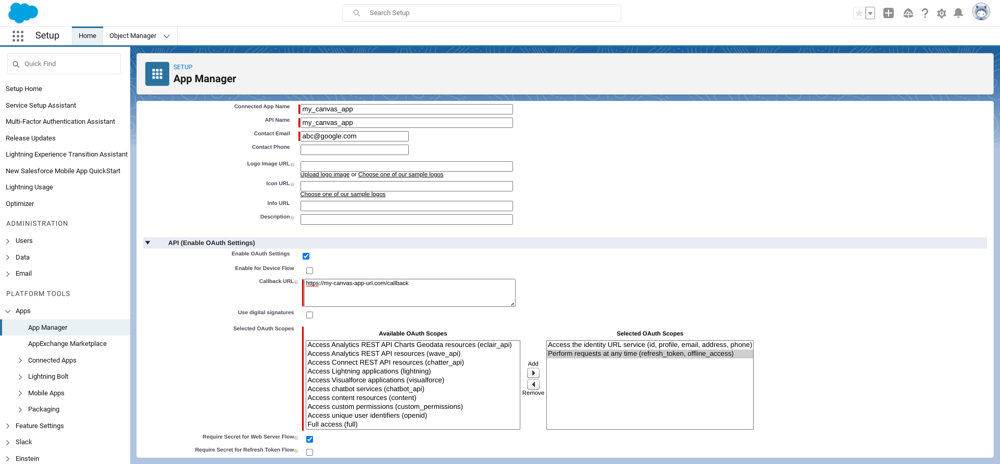

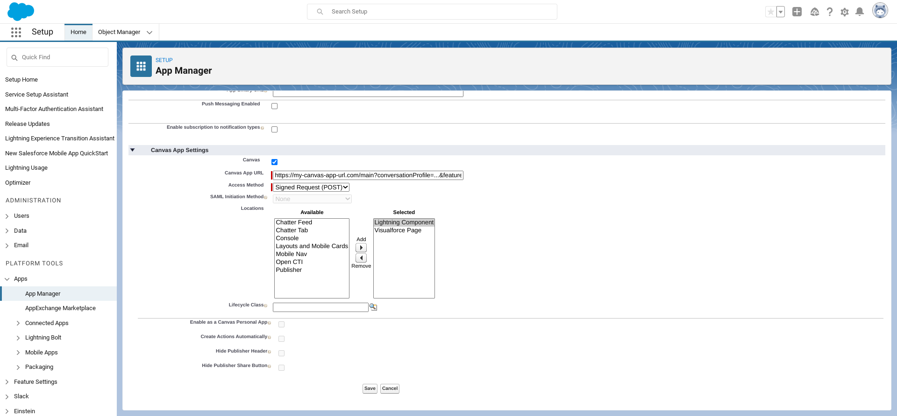

## 5. Configure environment variables
Once your Connected app has been created, you will need to create a `.env` file at the root of the Canvas app repository from Step 3 and add the following environment variables:
```
CANVAS_CONSUMER_KEY=...
CANVAS_CONSUMER_SECRET=...
PROXY_URL=...
```
* The proxy URL should be the URL of the UI Connector service you deployed in Step 1.
* The Canvas consumer key and consumer secret can be found in the Salesforce console.
  * Go to `Settings` -> `Setup` -> `Apps` -> `App Manager`. Click `View` on your connected app, and then click `Manage Consumer Details`
* Once you have added the environment variables, re-deploy the service.
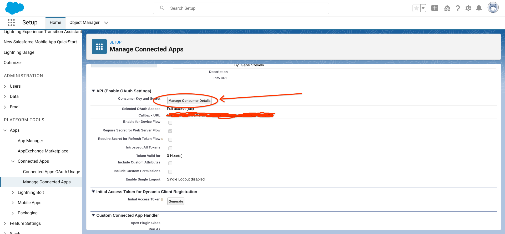

## 6. Create a Lightning component
In the Salesforce Developer Console, create a new Lightning component that will render the Canvas application. 

Open the Developer Console. Click `New` -> `Lightning Component`.
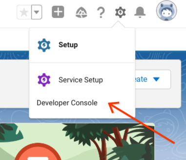

Insert the following code:
```
<aura:component implements="flexipage:availableForAllPageTypes" access="global" >
        <force:canvasApp height="705px" width="100%" canvasId="main" developerName="test_canvas"></force:canvasApp>
</aura:component>
```
* Feel free to change the `height` value to one that makes sense for your app
* Make sure the `developer_name` attribute matches the `API Name` field from the previous step.

## 7. Create a new Lightning application
In the Salesforce console, create a new Lightning application. 

Go to `Settings` -> `Set Up`. In the `App Manager`, click `New Lightning App`.

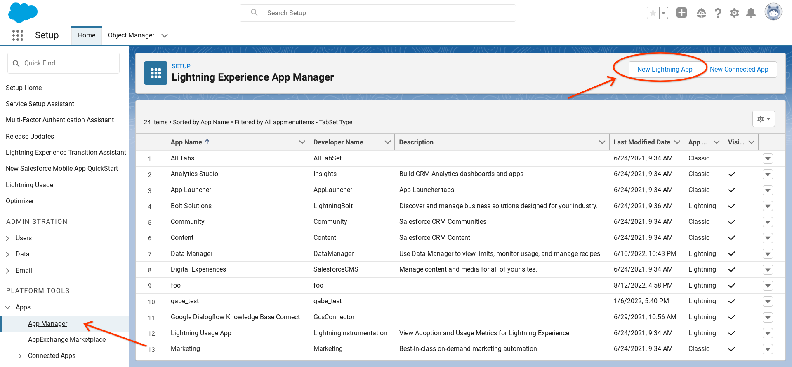

* Give it a name and developer name.
* Leave every option as is. Do not add any utility or navigation items.
* Pick which user profiles you want the app to be available for. For the sake of the demo, we selected `System Administrator`.
* Once it is created successfully, select your app in the App Manager and click `Edit`.

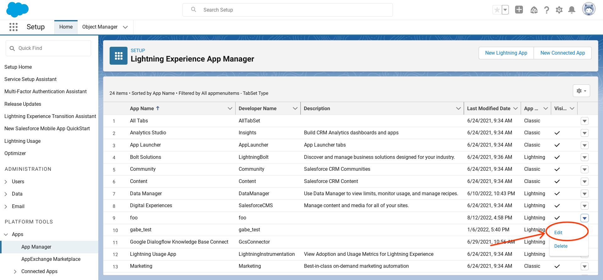

* Under Pages, add `New page`

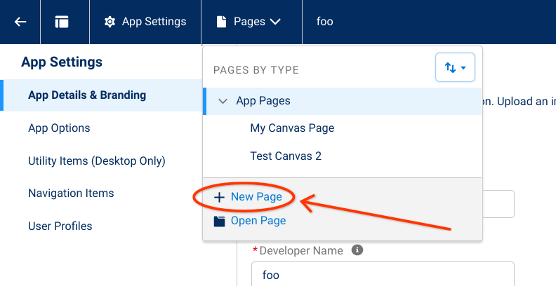

* Select `App Page`. For template, select `One region`
* Add the Lightning component from Step 5

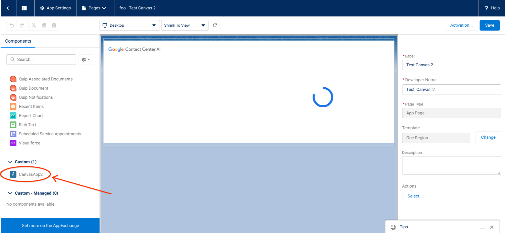

* Activate the page -> Add it to the Lightning Experience for the app you created before

## 8. Test it out
Visit your new Lightning application in Salesforce. You should now see the UI modules rendering on the page. 

* In the launcher, search for your app name and select it.

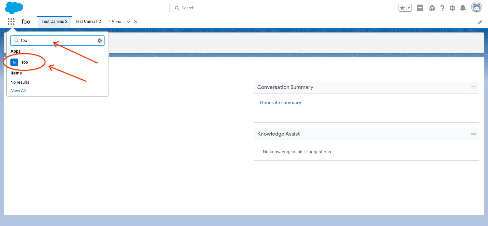

To test that the UI can receive new messages, make an API request to the Dialogflow API:

```
curl 'https://dialogflow.googleapis.com/v2beta1/<participant_name>:analyzeContent' \
  -X POST \
  -H "accept: */*" \
  -H "authorization: Bearer $(gcloud auth print-access-token)" \
  -H "x-goog-user-project: <project_name>" \
  -H "content-type: application/json" \
  --data-raw '{"messageSendTime":"2022-08-12T21:42:43.622Z","textInput":{"text":"Test message"}}' \
  --compressed
```

* Replace `<participant_name>` with the resource name of the Customer participant
  * You can find this by checking the logs in the Chrome developer console. 
  * The format should look like: projects/\_\_/locations/\_\_/conversations/\_\_/participants/\_\_
* Replace `<project_name>` with the name of your GCP project: i.e., `my-project`
* After making the API call, the message will be published to Pub/Sub and you should see it show up in the Salesforce UI. 
  * In the real world, your telephony provider would integrate with Dialogflow to make these API calls whenever an agent or customer utterance is recorded. 
* To test the summarization feature, generate a few different messages as both the agent and customer, and then click `Generate Summary` in the UI
