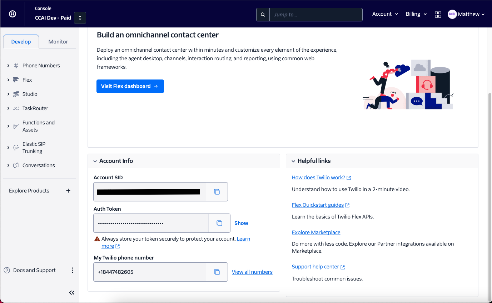
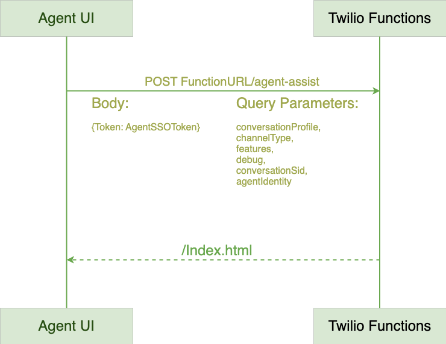

# Agent Assist Twilio Flex Integration

This project is a solution for integrating Agent Assist into a Twilio Flex instance.

## Prerequisites

- Twilio Account with Developer access
- Provisioned Flex Instance
- Account sid and Auth token
- Twilio CLI installed.
- Agent Assist Integrations Repository
- Agent Assist Integrations Backend Partner Repository

*Note: The following sections regarding the Twilio CLI are from the Twilio documentation and are compiled here for convenience.*


## Installation of Twilio dependencies

### Install the Twilio CLI

#### Prerequisites

- Node 18

*Currently, only Node.js 18 is supported. Please refer to node installation [documentation](https://docs.npmjs.com/downloading-and-installing-node-js-and-npm#using-a-node-installer-to-install-nodejs-and-npm).*

#### Linux

Install with Apt

```
wget -qO- https://twilio-cli-prod.s3.amazonaws.com/twilio_pub.asc \
  | sudo apt-key add -
sudo touch /etc/apt/sources.list.d/twilio.list
echo 'deb https://twilio-cli-prod.s3.amazonaws.com/apt/ /' \
  | sudo tee /etc/apt/sources.list.d/twilio.list
sudo apt update
sudo apt install -y twilio

```

#### Windows

To install the Twilio CLI, use the standard Windows user interface and your browser:

- In your browser, download the [latest Windows installation file](https://runtime-cli-redirect-6533.twil.io/redirect-to-github?ext=.exe)
- Run the downloaded file and follow the on-screen instructions.

#### Mac

To install using Homebrew

```
brew tap twilio/brew && brew install twilio
```

Another way to install the Twilio CLI is by using the standard macOS user interface and your browser:

- In your browser, download the [latest macOS installation file](https://runtime-cli-redirect-6533.twil.io/redirect-to-github?ext=.pkg)
- Run the downloaded file and follow the on-screen instructions.

### Install Flex Plugins CLI

#### Prerequisites

- NPM version 6.0.0 or later (type npm -v in your terminal to check)
- Node versions 14, 16 or 18 (type node -v in your terminal to check)

#### Install the Flex Plugin CLI

```
twilio plugins:install @twilio-labs/plugin-flex

```

#### Install the Serverless Plugin CLI

```
twilio plugins:install @twilio-labs/plugin-serverless

```


## Create a Profile for Twilio CLI

### Create a Profile

To issue CLI commands that include your Twilio credentials, you must first create a profile. To create a profile, use:

```
twilio login
```

You will be prompted for your Account SID and Auth Token, both of which you can find on the dashboard of your [Twilio console](https://www.twilio.com/console). When prompted for the Shorthand identifier input the name `dev`.



```
$ twilio login
You can find your Account SID and Auth Token at https://www.twilio.com/console
 » Your Auth Token will be used once to create an API Key for future CLI access to your Twilio Account or Subaccount, and then forgotten.
? The Account SID for your Twilio Account or Subaccount: ACXXXXXXXXXXXXXXXXXXXXXXXXXXXXXXXX
? Your Twilio Auth Token for your Twilio Account or Subaccount: [hidden]
? Shorthand identifier for your profile: dev
```

When you run `twilio login` (an alias for `twilio profiles:create`), it uses your Account SID and Auth Token to generate an API key, stores the key in a configuration file, and associates the key with the profile to authenticate future requests. For security, your Auth Token is only used to generate the API key, and is not stored locally once the profile has been created.

### Set an active profile

To set a profile as "active", run:

```
twilio profiles:use PROFILE_ID
```

Use the shorthand identifier from the previous step for the `PROFILE_ID`.

## Frontend Components

### Overview

The frontend solution consists of two components; Twilio functions and Twilio Plugins.

### Twilio Functions

The Twilio functions are serverless API endpoints that can perform unit of work hosted by Twilio. For this use case they provide user verification, chat service token and render the Agent Assist UI.




### Environment Variables

Create a file named .env in the agent-assist-functions directory. The following environment variables need to be set in order for the plugin to function after deployment:

| Variable | Type     | Location                |
| :-------- | :------- | :------------------------- |
| `TWILIO_ACCOUNT_SID` | `string` | Twilio Dashboard |
| `ACCOUNT_SID` | `string` | Same as above |
| `AUTH_TOKEN` | `string` | Twilio Dashboard |
| `TWILIO_API_KEY` | `string` | Create in Twilio console [here](https://www.twilio.com/console/runtime/api-keys/create) |
| `TWILIO_API_SECRET` | `string` | Create in Twilio console [here](https://www.twilio.com/console/runtime/api-keys/create) |
| `TWILIO_CHAT_SERVICE_SID` | `string` | Locate the service sid [here](https://console.twilio.com/us1/develop/chat/manage/services?frameUrl=/console/chat/services) |
| `PROXY_SERVER_URL` | `string` | Backend server URL. |


For more information regarding environment variable setup see [Environment Variables in Flex Plugins](https://www.twilio.com/docs/flex/developer/plugins/environment-variables)

### Twilio Plugins

### Overview

A Twilio Plugin is how we present the UI to the agent desktop.

### Environment Variables

Create a file named .env.dev in the agent-assist-plugins directory. The following environment variables need to be set in order for the plugin to function after deployment:

| Variable | Type     | Location                |
| :-------- | :------- | :------------------------- |
| `TWILIO_CONVERSATION_PROFILE` | `string` | GCP |
| `TWILIO_FEATURES` | `string` | Comma-separated list of Agent Assist suggestion features to render. Example: "SMART_REPLY, CONVERSATION_SUMMARIZATION" |
| `TWILIO_FUNCTIONS_URL` | `string` | This is the cloud run URL for the backend application. Will be made available here after you deploy the functions. Click twilio-agent-assist-functions and the bottom left corner you should have a URL like twilio-agent-assist-functions-####-dev.twil.io |
| `TWILIO_DEBUG` | `boolean` | Show logs in the console, can be true, false, or left undefined. |

## Deployment

The following scripts can be used to deploy the solution to your Twilio instance:

```bash
  npm run deploy:functions #Deploys just the functions to the Twilio instance
  npm run deploy:plugin #Deploys just the plugin to the Twilio instance, run command in next step to activate

```


## Backend Components

### Overview

For a custom backend that you can deploy to within your GCP Project see the aa-integration-backend directory in our [aa-integration-backend repository](https://github.com/GoogleCloudPlatform/agent-assist-integrations/tree/HEAD/aa-integration-backend). In there you will find all the documentation and scripts needed to successfully deploy the backend components for agent assist. 
Further documentation can be found [here](https://cloud.google.com/agent-assist/docs/backend-basics) in the Google Cloud documentation.


## Documentation

- [Install the Twilio CLI](https://www.twilio.com/docs/twilio-cli/getting-started/install)
- [Install Flex Plugins CLI](https://www.twilio.com/docs/flex/developer/plugins/cli/install)
- [Profiles](https://www.twilio.com/docs/twilio-cli/general-usage/profiles)
- [agent-assist-integrations repository](https://github.com/GoogleCloudPlatform/agent-assist-integrations)
- [API key for your Twilio Account](https://www.twilio.com/console/runtime/api-keys/create)
- [Environment Variables in Flex Plugins](https://www.twilio.com/docs/flex/developer/plugins/environment-variables)
- [aa-integration-backend repository](https://github.com/GoogleCloudPlatform/agent-assist-integrations/tree/HEAD/aa-integration-backend).
- [Agent Assist backend modules basics](https://cloud.google.com/agent-assist/docs/backend-basics)


## Twilio Functions API Reference

#### Agent Assist

```http
  GET /agent-assist
```

| Parameter | Type     | Description                |
| :-------- | :------- | :------------------------- |
| `conversationProfile` | `query` | **Required**. Resource ID of the conversation profile.  |
| `conversationSid` | `query` | **Required**. The generated SID for the conversation.|
| `features` | `query` | **Required**. The features that will be active on the agent desktop. [List of available features](https://cloud.google.com/agent-assist/docs/ui-modules-container-documentation) |
| `agentIdentity` | `query` | **Required**. The ID of the agent. |
| `channelType` | `query` | **Required**. The type of communication channel of the task  |
| `debug` | `query` | **Required**. Show debug messages in the console |

#### Verify Token

```http
  GET /verify-token
```

| Parameter | Type     | Description                       |
| :-------- | :------- | :-------------------------------- |
| `Token`      | `Body` | **Required**. Agent JWT |


